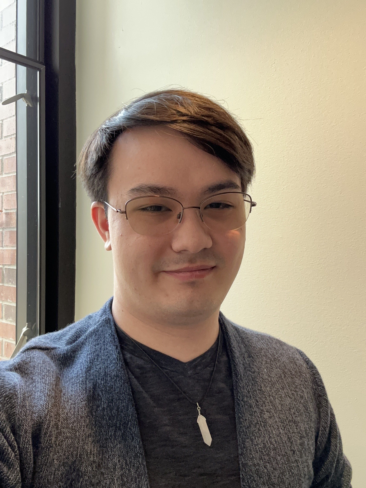

# About Me

---

## Emerie Tattersall (they/them)
Hello! I'm a student at Whitman studying Computer Science. 
I built this page to showcase my final project for my Data Science course.

---

## Academic Background
* **School:** Whitman College
* **Major:** Computer Science
* **Expected Graduation:** 2027
* **Completed Coursework:** Data Structures, Computer Simulation Methods, Discrete Math & Func. Prog., Computer Systems Fundamentals
* **Programming:** Intermediate Python, C++
* **Tools:** GitHub, VS Code

---

## Contact
* **Email:** tatterse@whitman.edu
* **GitHub:** https://github.com/emi471
